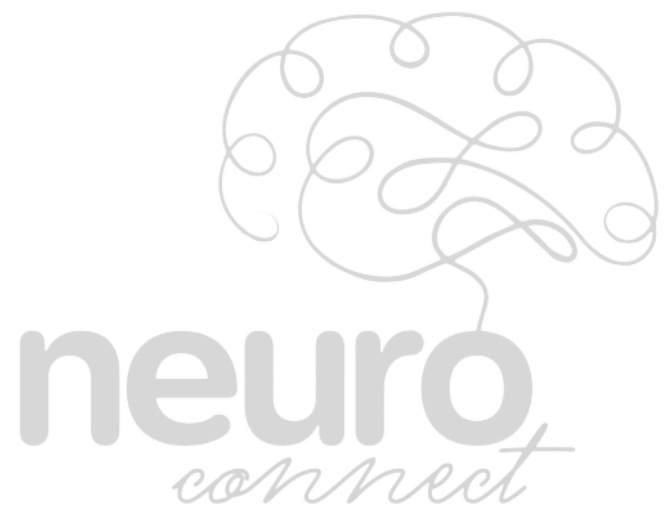

# Portal web Neuro Connect



## Realizando o sonho da vida profissional dos neurodivergentes!

## Tecnologias e Ferramentas Utilizadas

<div align="center">


</div>

- **Git e Github**: Para controle de versionamento.
- **Next.js** - Framework react para aplicações web fullstack.
- **React** - Biblioteca para construção de interfaces, é utilizado de forma indireta por conta do next.js.
- **Axios** - Cliente HTTP para comunicação com a API.
- **TailWind CSS** - Framework utilitário de CSS para estilização rápida e responsiva.
- **Prisma ORM** - Mapeamento objeto-relacional para interação com o banco de dados.
- **SQLite** - Banco de dados leve, utilizado no desenvolvimento.


## Executar

O projeto foi realizado utilizando **Next.js**, abaixo estão os requisitos necessários para executar o projeto do zero.

- Requisitos:
   - Node.js instalado
   - npm (que já vem com o Node.js)

- No terminal/console/shell:

```bash
    git clone https://github.com/DiegoSabinoMinichiello/portal-neuro
    cd frontend     
    npm install
    npx prisma db push
    npm run seed
    npm run dev
```
Após executar, em um navegador, acesse: [http://localhost:3000](http:localhost:3000) 

---

## Telas atualmente implementadas

- [Home](./frontend/pages/index.js): Página inicial do site, responsável pelo primeiro contato do usuário com o site.
- [Login](./frontend/pages/login-usuario.js): Página de login, que redireciona para o devido dashboard.
- [Cadastro](./frontend/pages/cadastro.js): Página de cadastro, que cria um novo usuário consultor ou empresa.
- [Dashboard Admin](./frontend/pages/dashboard-admin.js): Dashboard do admin, Tem acesso a todos os usuários cadastrados, pode criar novos usuários, excluir usuários, e filtrar os usuários por tipo.
- [Dashboard Consultor](./frontend/pages/dashboard-consultor.js): Dashboard do consultor.
- [Dashboard Empresa](./frontend/pages/dashboard-empresa.js): Dashboard da empresa.

---


<div align="center">

**Instagram**: @selo.neuroconnect2

**Email**: selo.neuroconnect@gmail.com

Rodovia SC 484 - Km 02, Fronteira Sul Chapecó, SC - Brasil CEP 89815-899

**© 2025 Neuro Connect. Todos os direitos reservados.**
</div>